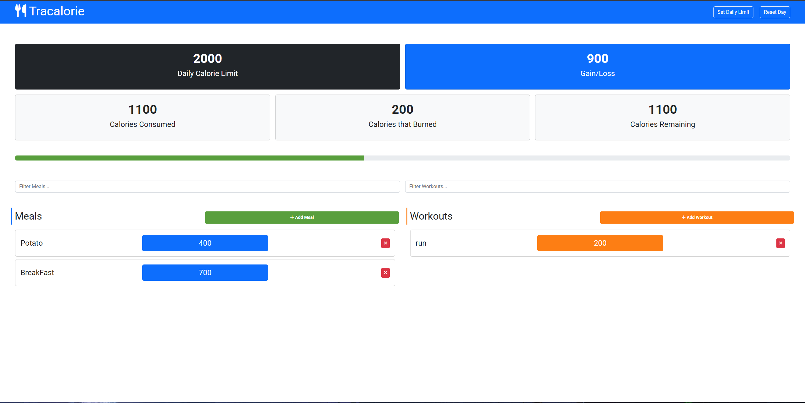

# Tracalorie



[](LICENSE)


**Tracalorie** is a lightweight, modular calorie-tracking single-page app built using modern JavaScript (ES6+), Bootstrap 5, LocalStorage, and Webpack.

---

## 🚀 Features

- Add/remove **Meals** and **Workouts**
- Persistent data using **LocalStorage**
- Daily stats: total, consumed, burned, remaining
- Progress bar showing calorie usage
- Editable daily calorie limit via modal
- Real-time filtering for meals/workouts
- Smooth animations for adding & removing items
- Reset day (clear all stored data)

---

## 🛠 Tech Stack

- **JavaScript (ES6+)**
- **Bootstrap 5**
- **Font Awesome**
- **LocalStorage API**
- **Webpack**

---

## ⚙️ Install & Run

1. Clone the repository:

```bash
git clone <your-repo-url>
cd tracalorie
```

2. Install dependencies:

```bash
npm install
```

3. Start development with hot reload:

```bash
npm run dev
```

4. Build production version:

```bash
npm run build
```

5. Open:

- `index.html` (static)
- or visit `http://localhost:8080` if using webpack dev server

---

## 🎞️ Demo GIF


---

## 📁 Project Structure

```
Tracalorie App/
├── src/
│   ├── components/
│   │   ├── Items/        # Items.js (Meal, Workout)
│   │   ├── Storage/      # Storage.js
│   │   └── Tracker/      # Tracker.js
│   ├── css/
│   ├── webfonts/
│   └── app.js
├── index.html
├── webpack.config.js
├── package.json
├── package-lock.json
├── .gitignore
├── favicon.ico
└── project_diagram.png
```

---


